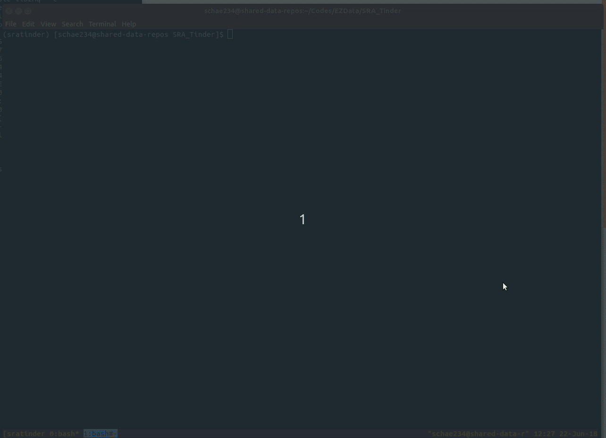

# *Find hot data sets in your area (of research)!*
 


Have you ever spent weeks interacting with SRA data and then decided it just wasn't going to work? That's like going on a blind date with someone you have no interest in. It's a huge waste of your time!


Here we introduce SRA_Tinder, the package that allows you to preview your fastq files before you date them. Go ahead, swipe left. Don't date that ugly data! Or Swipe right and find the love of your data life.
Our goal is to show you only the most essential information about your SRA data sets, and let you decide which ones are right for you.

## Quick Start (no installation necessary)
```
$ git clone https://github.com/NCBI-Hackathons/SRA_Tinder
$ cd SRA_Tinder
$ python3 SRA_Tinder/sra_tinder.py --input SraAccList.txt --essential
```

```
$ git clone https://github.com/NCBI-Hackathons/SRA_Tinder
$ cd SRA_Tinder
$ python3 SRA_Tinder/sra_tinder.py --input SraAccList.txt
```


# Dependencies
Requires python 3.6

Requires setuptools (https://pip.pypa.io/en/stable/installing/)

# Installation
Installation is a three step process:
### Step 1:
```
# Clone the repo
$ git clone https://github.com/NCBI-Hackathons/EZData
```
### Step 2:
```
# Install the included SRA SDK
$ cd deps/ngs-sdk.2.9.0-linux/ngs-python
$ python setup.py install
```
### Step 3:
```
# move back to base directory
$ cd ../../..
$ python setup.py install
```


Input is a SRR number list from runselector, output is a tab delemted table.

python sra_tinder_matches.py SRA_Acc_list.txt

For example you can test the code using this

# Usage:
After installation, a command line interface (CLI) will be available through your shell
```
$ sra_tinder
usage: sra_tinder [-h] Available Commands ...

Find hot datasets in your area (of research)!

optional arguments:
  -h, --help          show this help message and exit

Command Line Programs:
  Use --help with each command for more info

  Available Commands
    stream            Stream SRA FASTQ files into named pipes
    match             create SRA matches

version: 0.0.1
install path: /home/rob/Codes/SRATinder/SRA_Tinder/CLI/sra_tinder

```
By default `sra_tinder` comes with 2 built in commands:

1. stream
2. match

## Streaming
```
$ sra_tinder stream -h
usage: sra_tinder stream [-h] [--input INPUT]

optional arguments:
  -h, --help     show this help message and exit
  --input INPUT  input file, one SRR per line
```
Streaming takes as input a single file containing SRA Accession numbers (one per line). `sra_tinder` will open a linux named 
pipe in the current directory and stream reads to those files as needed.


 
 Files can be processed in parallel but streaming will only occur with at most processes as there are processors available.

### Example run:  
To get your own SRA_Acc_list.txt go to https://www.ncbi.nlm.nih.gov/Traces/study/ and type in a SRR number or a Bioproject number, go to the run selector, and click Accession List.
### Ongoing work:
The full vision of this project is to have an abundance of metadata for SRA datasets *that is derived from only the reads present in the sample* and not the user submitted metadata.
It was our goal to implement a random forest model capable of classifying ~10 types of DNA and RNA data based on the reads present
(similar to what has already been done with PARTIE - https://github.com/linsalrob/partie).
While that specific goal was beyond the scope of this hackathon project, the purpose and promise of such a project will likely ensure that it is done in the future.


